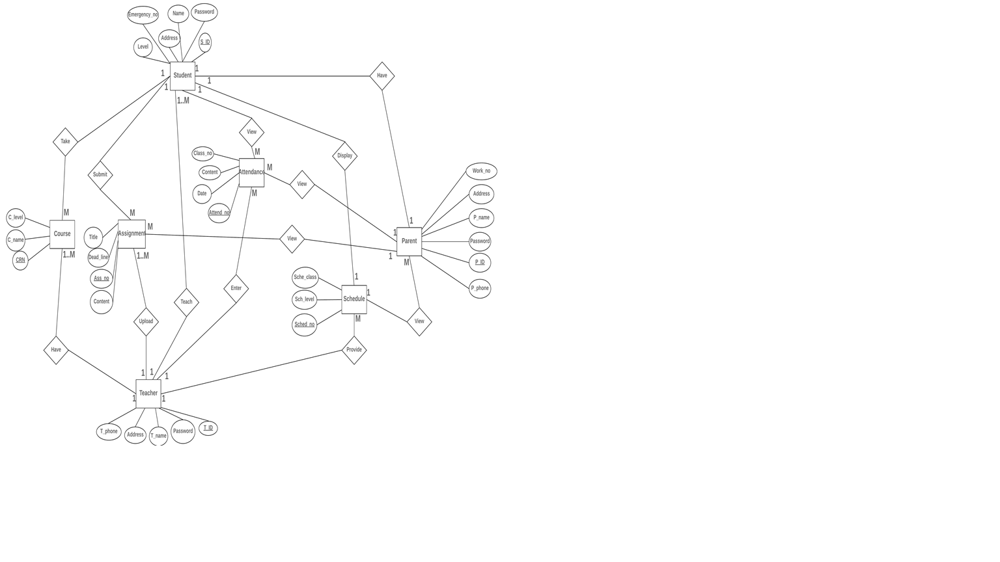

# Private International School System

## About The Project:
The project is an educational system aimed at schools, students and parents of the students. The aim is to bring a new level of intelligence to the academic system. The traditional academic education system can no longer be used in today's world as new technology and learning styles has been implemented in many developed countries. That's why the aim is to create a new system with new creative ideas that will help the school system to improve. The system will have many new features that are not available in other systems.

### Deployed link:
####SOON

## Technology used :
- PHP 
 - MYSQL
 - Bootstrap
 - Jquery

## ERD:

## UI

## Installation

